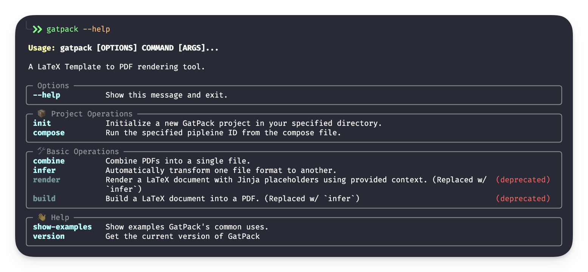

# GatPack

  [](https://github.com/GatlenCulp/gatpack/actions/workflows/tests.yml) [](https://github.com/astral-sh/uv) 

https://gatlenculp.github.io/gatpack

More documentation in getting-started.md of the cookiecutter repo.

<h1 align="center">
  <a href="https://github.com/GatlenCulp/gatpack">
    
  </a>
</h1>

<div align="center">
  GatPack
  <br />
  <a href="#about"><strong>Explore the docs »</strong></a>
  <br />
  <br />
  <a href="https://github.com/GatlenCulp/gatpack/issues/new?assignees=&labels=bug&template=01_BUG_REPORT.md&title=bug%3A+">Report a Bug</a>
  ·
  <a href="https://github.com/GatlenCulp/gatpack/issues/new?assignees=&labels=enhancement&template=02_FEATURE_REQUEST.md&title=feat%3A+">Request a Feature</a>
  .
  <a href="https://github.com//gatpack/issues/new?assignees=&labels=question&template=04_SUPPORT_QUESTION.md&title=support%3A+">Ask a Question</a>
</div>

<div align="center">
<br />

[](LICENSE)
[](https://github.com/GatlenCulp/gatpack/issues?q=is%3Aissue+is%3Aopen+label%3A%22help+wanted%22)
[](https://github.com/GatlenCulp)

<!-- TODO: Borrow from https://pypi.org/project/latexbuild/ -->

<!-- TODO: Maybe remove some of these sections, this feels a bit unnecessarily verbose. -->

</div>

______________________________________________________________________

## About

<table><tr><td>
GatPack is a CLI and Python API for automating LaTeX and PDF document generation using [Jinja templating](https://jinja.palletsprojects.com/en/stable/api/). This was originally developed for creating professional looking packets for AI safety coursework at [MIT AI Alignment](https://aialignment.mit.edu).

<details>
<summary>Screenshots</summary>
<br>

> **[?]**
> Please provide your screenshots here.

|                                  CLI                                   |                          Generated Cover Page                          |
| :--------------------------------------------------------------------: | :--------------------------------------------------------------------: |
|  |  |

</details>

</td></tr></table>

### Built With

- Typer (For the CLI)
- LaTeX (For creating documents from text)
- Jinja (For templating and placeholders)
- Pydantic (For specifying the config file schema)

______________________________________________________________________

## Getting Started

### 01 Install GatPack

Run the following command to install globally:

```bash
python3 -m pip install gatpack
```

### 02 Initialize your project

cd into the directory you would like to create your project and run

```bash
gatpack init
```

Follow the set up steps to name your project.

### 03 Edit the Workflow

Open the example workflow located in `YOUR_PROJECT/build.sh`. You will see a number of commands outlining the workflow. These are fairly self explanatory.

```bash
#!/bin/bash

# Exit on any error
set -e
# Exit on any undefined variable
set -u
# Exit if any command in a pipe fails
set -o pipefail

COMPOSE=compose.gatpack.json

COVER_LATEX_TEMPLATE=cover/cover.jinja.tex
COVER_LATEX=cover/cover.tex
COVER_PDF=cover/cover.pdf

DEVICE_READINGS_LATEX_TEMPLATE=device_readings/device_readings.jinja.tex
DEVICE_READINGS_LATEX=device_readings/device_readings.tex
DEVICE_READINGS_PDF=device_readings/device_readings.pdf

READINGS_PDFS=readings/*.pdf

FURTHER_READINGS_LATEX_TEMPLATE=further_readings/further_readings.jinja.tex
FURTHER_READINGS_LATEX=further_readings/further_readings.tex
FURTHER_READINGS_PDF=further_readings/further_readings.pdf

OUTPUT_PDF=output/packet.pdf

# Build Cover Page
rm -f $COVER_LATEX
rm -f $COVER_PDF
gatpack render \
    $COVER_LATEX_TEMPLATE \
    $COVER_LATEX \
    $COMPOSE
gatpack build \
    $COVER_LATEX \
    $COVER_PDF

# Build Device Readings Page
rm -f $DEVICE_READINGS_LATEX
rm -f $DEVICE_READINGS_PDF
gatpack render \
    $DEVICE_READINGS_LATEX_TEMPLATE \
    $DEVICE_READINGS_LATEX \
    $COMPOSE
gatpack build \
    $DEVICE_READINGS_LATEX \
    $DEVICE_READINGS_PDF

# Build Further Readings Page
rm -f $FURTHER_READINGS_LATEX
rm -f $FURTHER_READINGS_PDF
gatpack render \
    $FURTHER_READINGS_LATEX_TEMPLATE \
    $FURTHER_READINGS_LATEX \
    $COMPOSE
gatpack build \
    $FURTHER_READINGS_LATEX \
    $FURTHER_READINGS_PDF

# Combine all readings into "packet.pdf"
rm -f $OUTPUT_PDF
gatpack combine \
    $COVER_PDF \
    $DEVICE_READINGS_PDF\
    $FURTHER_READINGS_PDF \
    $OUTPUT_PDF
    # $READINGS_PDFS \

open $OUTPUT_PDF
```

### 04 Edit the Compose File

Opening `YOUR_PROJECT/compose.gatpack.json` will reveal a number of configuration files. Everything in the `context` object can be used to fill in Jinja placeholders when passed as an argument to `gatpack`.

### 05 Edit the Template

The LaTeX template files are denoted with `*.jinja.tex`. See the instructions on writing LaTeX-Jinja templates down below.

### 06 Build your Project

Run the `build.sh` script. Check that `output/packet.pdf` was successfully built.

______________________________________________________________________

### Prerequisites

- Python 3.10+
- LaTeX

### Installation

Run the following command to install globally (or install into a virtual environment and activate, whichever you prefer.):

```bash
python3 -m pip install gatpack
```

To use `gatpack build` which will convert a LaTeX document to a PDF, you will need `pdflatex` to be available on your path. You can check for this with

```bash
pdflatex --verison
```

If this command isn't found, then you need to install a LaTeX compiler to your machine.

For mac you can install [MacTeX](https://www.tug.org/mactex/mactex-download.html). Using Homebrew:

```bash
brew install --cask mactex
```

_Note: Eventually this LaTeX requirement will be removed_

<!-- I should take a look at this: https://pypi.org/project/pdflatex/ -->

You can then run the following to confirm GatPack has been successfully installed (will not check for a valid pdflatex):

```bash
gatpack --help
```

## Usage

`gatpack --help` will provide various information about how to use the tool. You can get further help with subcommands using `gatpack COMMAND --help`

```bash

 Usage: gatpack [OPTIONS] COMMAND [ARGS]...

╭─ Options ─────────────────────────────────────────────────────────────────────────────────╮
│ --install-completion          Install completion for the current shell.                   │
│ --show-completion             Show completion for the current shell, to copy it or        │
│                               customize the installation.                                 │
│ --help                        Show this message and exit.                                 │
╰───────────────────────────────────────────────────────────────────────────────────────────╯
╭─ Commands ────────────────────────────────────────────────────────────────────────────────╮
│ init      Initialize a new GatPack project in your specified directory.                   │
│ render    Render a specified LaTeX document with Jinja placeholders with provided         │
│           context.                                                                        │
│ combine   Combine any number of PDFs into a single PDF.                                   │
│ build     Build a LaTeX document into a PDF.                                              │
╰───────────────────────────────────────────────────────────────────────────────────────────╯
```

### Jinja Modifications for LaTeX (`gatpack render`)

Standard Jinja placeholders: `{{ variable_name }}`, ` `, etc. don't play well with LaTeX. It becomes very difficult to view your LaTeX template since you run into syntax errors and some LaTeX syntax conflicts with Jinja tags, leading to errors from both systems. These Jinja placeholders were changed to the following,

| Function | New | Original | Usage |
| -------- | --- | -------- | ----- |
|          |     |          |       |

_This was based on a useful but outdated project called [latexbuild](https://pypi.org/project/latexbuild/)_

### Usage Examples

- You want to combine multiple files into a packet: `pdfs/document1.pdf`, `pdfs/document2.pdf`, and `pdfs/document3.pdf`. This makes printing and stapling multiple copies easier: `gatpack combine pdfs/*.pdf packet.pdf`

- You want to build and reuse a LaTeX template for an invoice: `invoice.jinja.tex`. To do this, render your template using Jinja placeholders into `invoice.tex` using the assignments from `compose.gatpack.json` then build your invoice to a pdf `invoice.pdf`:

  ```bash
  gatpack render invoice.jinja.tex invoice.tex compose.gatpack.json
  gatpack build invoice.tex invoice.pdf
  ```

## Roadmap

See the [open issues](https://github.com/GatlenCulp/gatpack/issues) for a list of proposed features (and known issues).

- [Top Feature Requests](https://github.com/GatlenCulp/gatpack/issues?q=label%3Aenhancement+is%3Aopen+sort%3Areactions-%2B1-desc) (Add your votes using the 👍 reaction)

- [Top Bugs](https://github.com/GatlenCulp/gatpack/issues?q=is%3Aissue+is%3Aopen+label%3Abug+sort%3Areactions-%2B1-desc) (Add your votes using the 👍 reaction)

- [Newest Bugs](https://github.com/GatlenCulp/gatpack/issues?q=is%3Aopen+is%3Aissue+label%3Abug)

- [ ] Change Jinja template delimiters to be LaTeX friendly (Highest priority)

- [ ] Fix the actual Jinja LaTeX templates for packet making to look nice

- [ ] Add a padding command that will make sure all PDFs have an even number of pages before merging (that way unrelated documents don't get printed on the front and back side of the same page)

- [ ] Better syntax for the CLI

- [ ] Make it easier to chain together multiple gatpack calls

- [ ] Footers

## Support

> **[?]**
> Provide additional ways to contact the project maintainer/maintainers.

Reach out to the maintainer at one of the following places:

- [GitHub issues](https://github.com/GatlenCulp/gatpack/issues/new?assignees=&labels=question&template=04_SUPPORT_QUESTION.md&title=support%3A+)
- Contact options listed on [this GitHub profile](https://github.com/GatlenCulp)

## Project assistance

If you want to say **thank you** or/and support active development of GatPack:

- Add a [GitHub Star](https://github.com/GatlenCulp/gatpack) to the project.
- Tweet about the GatPack.
- Write interesting articles about the project on [Dev.to](https://dev.to/), [Medium](https://medium.com/) or your personal blog.

Together, we can make GatPack **better**!

## Contributing

First off, thanks for taking the time to contribute! Contributions are what make the open-source community such an amazing place to learn, inspire, and create. Any contributions you make will benefit everybody else and are **greatly appreciated**.

Please read [our contribution guidelines](docs/CONTRIBUTING.md), and thank you for being involved!

## Authors & contributors

The original setup of this repository is by [](https://github.com/GatlenCulp).

For a full list of all authors and contributors, see [the contributors page](https://github.com/GatlenCulp/gatpack/contributors).

## Security

GatPack follows good practices of security, but 100% security cannot be assured.
GatPack is provided **"as is"** without any **warranty**. Use at your own risk.

_For more information and to report security issues, please refer to our [security documentation](docs/SECURITY.md)._

## License

This project is licensed under the **MIT**.

See [LICENSE](LICENSE) for more information.

## Acknowledgements

> **[?]**
> If your work was funded by any organization or institution, acknowledge their support here.
> In addition, if your work relies on other software libraries, or was inspired by looking at other work, it is appropriate to acknowledge this intellectual debt too.

## Project Organization

<details><summary>Project Organization</summary>

```
📁 .
├── ⚙️ .cursorrules                    <- LLM instructions for Cursor IDE
├── 💻 .devcontainer                   <- Devcontainer config
├── ⚙️ .gitattributes                  <- GIT-LFS Setup Configuration
├── 🧑‍💻 .github
│   ├── ⚡️ actions
│   │   └── 📁 setup-python-env       <- Automated python setup w/ uv
│   ├── 💡 ISSUE_TEMPLATE             <- Templates for Raising Issues on GH
│   ├── 💡 pull_request_template.md   <- Template for making GitHub PR
│   └── ⚡️ workflows
│       ├── 🚀 main.yml               <- Automated cross-platform testing w/ uv, precommit, deptry,
│       └── 🚀 on-release-main.yml    <- Automated mkdocs updates
├── 💻 .vscode                        <- Preconfigured extensions, debug profiles, workspaces, and tasks for VSCode/Cursor powerusers
│   ├── 🚀 launch.json
│   ├── ⚙️ settings.json
│   ├── 📋 tasks.json
│   └── ⚙️ 'gatpack.code-workspace'
├── 🐳 docker                            <- Docker configuration for reproducability
├── 📚 docs                              <- Project documentation (using mkdocs)
├── 👩‍⚖️ LICENSE                           <- Open-source license if one is chosen
├── 📋 logs                              <- Preconfigured logging directory for
├── 👷‍♂️ Makefile                          <- Makefile with convenience commands (PyPi publishing, formatting, testing, and more)
├── ⚙️ pyproject.toml                     <- Project configuration file w/ carefully selected dependency stacks
├── 📰 README.md                         <- The top-level README
├── 🔒 secrets                           <- Ignored project-level secrets directory to keep API keys and SSH keys safe and separate from your system (no setting up a new SSH-key in ~/.ssh for every project)
│   └── ⚙️ schema                         <- Clearly outline expected variables
│       ├── ⚙️ example.env
│       └── 🔑 ssh
│           ├── ⚙️ example.config.ssh
│           ├── 🔑 example.something.key
│           └── 🔑 example.something.pub
└── 🚰 'gatpack'  <- Easily publishable source code
    ├── ⚙️ config.py                     <- Store useful variables and configuration (Preset)
    ├── 🐍 dataset.py                    <- Scripts to download or generate data
    ├── 🐍 features.py                   <- Code to create features for modeling
    ├── 📁 modeling
    │   ├── 🐍 __init__.py
    │   ├── 🐍 predict.py               <- Code to run model inference with trained models
    │   └── 🐍 train.py                 <- Code to train models
    └── 🐍 plots.py                     <- Code to create visualizations
```

</details>
