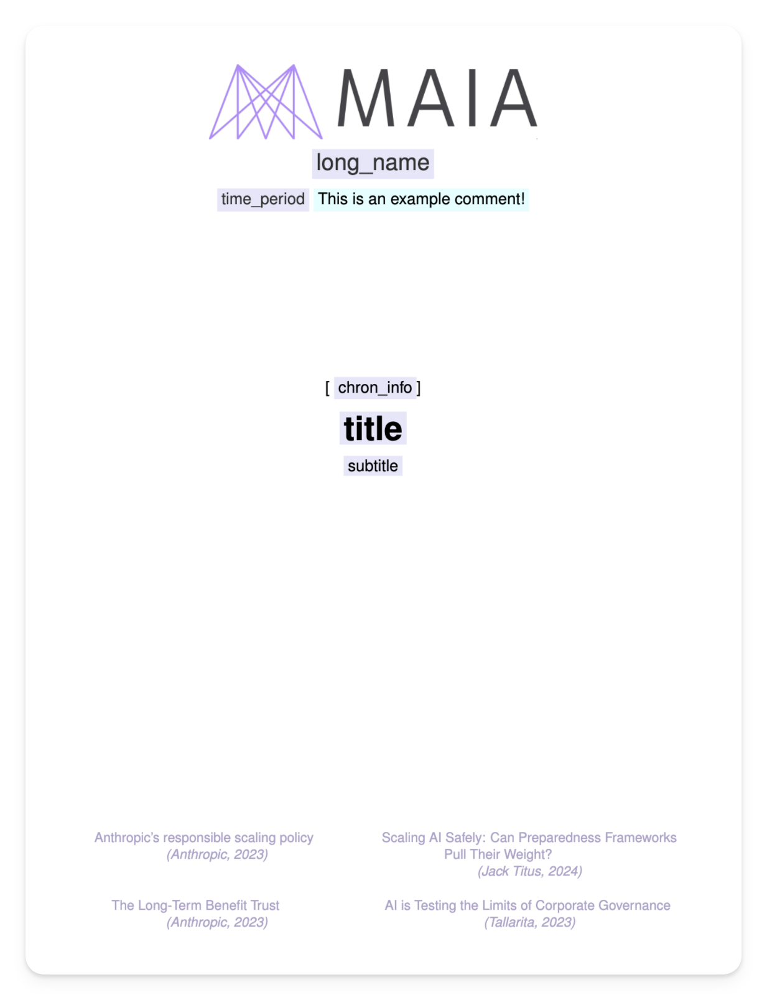
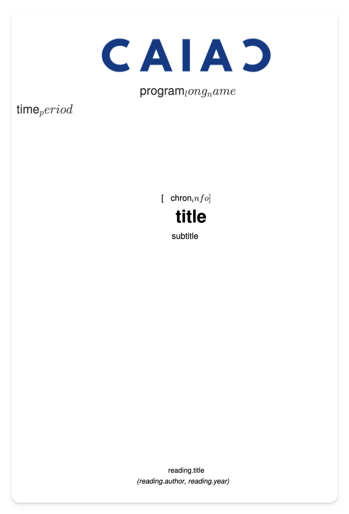

<h1 align="center">
  <a href="https://github.com/GatlenCulp/gatpack">
    
  </a>
</h1>

<div align="center">
  <h1> GatPack </h1>
  <a href="#about"><strong>Explore the docs »</strong></a>
  <br />
  
  <br />
  <a href="https://github.com/GatlenCulp/gatpack/issues/new?assignees=&labels=bug&template=01_BUG_REPORT.md&title=bug%3A+">Report a Bug</a>
  ·
  <a href="https://github.com/GatlenCulp/gatpack/issues/new?assignees=&labels=enhancement&template=02_FEATURE_REQUEST.md&title=feat%3A+">Request a Feature</a>
  .
  <a href="https://github.com//gatpack/issues/new?assignees=&labels=question&template=04_SUPPORT_QUESTION.md&title=support%3A+">Ask a Question</a>
</div>

<div align="center">
<br />

[](LICENSE) [](https://github.com/GatlenCulp/gatpack/issues?q=is%3Aissue+is%3Aopen+label%3A%22help+wanted%22) [](https://github.com/GatlenCulp)

  [](https://github.com/GatlenCulp/gatpack/actions/workflows/tests.yml) [](https://github.com/astral-sh/uv) 

<!-- TODO: Borrow from https://pypi.org/project/latexbuild/ -->

<!-- TODO: Maybe remove some of these sections, this feels a bit unnecessarily verbose. -->

</div>

______________________________________________________________________

## About

GatPack is a CLI and Python API for automating LaTeX and PDF document generation using [Jinja templating](https://jinja.palletsprojects.com/en/stable/api/). This was originally developed for creating professional looking packets for AI safety coursework at [MIT AI Alignment](https://aialignment.mit.edu).

<details>
<summary>Screenshots</summary>
<br>

|                                  CLI                                   |                          Generated Cover Page                          |                            Pre-Rendered Cover Page                             |
| :--------------------------------------------------------------------: | :--------------------------------------------------------------------: | :----------------------------------------------------------------------------: |
|  |  |  |

</details>

<details>
<summary>Built With</summary>
<br>

- Typer (For the CLI)
- LaTeX (For creating documents from text)
- Jinja (For templating and placeholders)
- Pydantic (For specifying the config file schema)

</details>

<details>
<summary>See who is using</summary>
<br>

- [MIT AI Alignment (MAIA)](https://aialignment.mit.edu/)
- [AI Safety Student Team (AISST)](https://haist.ai/) at Harvard
- [Columbia AI Alignment Club (CAIAC)](https://www.cualignment.org/)

Let us know if your team is using it an how!

</details>

<details>
<summary>Table of Contents</summary>
<br>

<!-- @import "[TOC]" {cmd="toc" depthFrom=1 depthTo=6 orderedList=false} -->

<!-- code_chunk_output -->

- [About](#about)
- [Getting Started](#getting-started)
  - [00 Requirements (Python & LaTeX)](#00-requirements-python--latex)
  - [01 Install GatPack (`pip install gatpack`)](#01-install-gatpack-pip-install-gatpack)
  - [02 Initialize your project (`gatpack init`)](#02-initialize-your-project-gatpack-init)
  - [03 Build the Example project](#03-build-the-example-project)
  - [04 (Optional) Learn How the Example Projects Work](#04-optional-learn-how-the-example-projects-work)
    - [04.01 Understand the LaTeX Templates (`*.jinja.tex`)](#0401-understand-the-latex-templates-jinjatex)
    - [04.02 Understand the Compose File (`compose.gatpack.json`)](#0402-understand-the-compose-file-composegatpackjson)
- [Usage](#usage)
  - [01 CLI Help](#01-cli-help)
  - [02 LaTeX-Modified Jinja (`gatpack render`)](#02-latex-modified-jinja-gatpack-render)
  - [03 Usage Examples](#03-usage-examples)
  - [04 Going Beyond LaTeX & PDFs](#04-going-beyond-latex--pdfs)

<!-- /code_chunk_output -->

</details>

______________________________________________________________________

## Getting Started

### 00 Requirements (Python & LaTeX)

- Python 3.10+
- LaTeX (`pdflatex` specifically, see more instructions on installing below)

### 01 Install GatPack (`pip install gatpack`)

Run the following command to install globally:

```bash
python3 -m pip install gatpack
```

<details>
<summary>Further Install Instructions</summary>
<br />

Run the following command to install globally (or install into a virtual environment and activate, whichever you prefer.):

```bash
python3 -m pip install gatpack
```

To use `gatpack build` which will convert a LaTeX document to a PDF, you will need `pdflatex` to be available on your path. You can check for this with

```bash
pdflatex --verison
```

If this command isn't found, then you need to install a LaTeX compiler to your machine.

For mac you can install [MacTeX](https://www.tug.org/mactex/mactex-download.html). Using Homebrew:

```bash
brew install --cask mactex
```

_Note: Eventually this LaTeX requirement will be removed_

<!-- I should take a look at this: https://pypi.org/project/pdflatex/ -->

You can then run the following to confirm GatPack has been successfully installed (will not check for a valid pdflatex):

```bash
gatpack --help
```

<br />
</details>

### 02 Initialize your project (`gatpack init`)

cd into the directory you would like to create your project and run

```bash
gatpack init
```

Follow the set up steps to name your project.

_Source code for the project template can be found [here](https://github.com/GatlenCulp/cookiecutter-gatpack)_

<!-- ### 03 Build the Example Project (`build.sh`)

Run the `build.sh` script. Check that `output/packet.pdf` was successfully built. -->

### 03 Build the Example project

```bash
gatpack compose reading-packet --overwrite
```

### 04 (Optional) Learn How the Example Projects Work

#### 04.01 Understand the LaTeX Templates (`*.jinja.tex`)

The LaTeX template files are denoted with `*.jinja.tex`. See the instructions on writing LaTeX-Jinja templates in the [02 LaTeX-Modified Jinja (`gatpack render`)](#02-latex-modified-jinja-gatpack-render) section down below

#### 04.02 Understand the Compose File (`compose.gatpack.json`)

Opening `YOUR_PROJECT/compose.gatpack.json` will reveal a number of variable assignments. Everything in the `context` object can be used to fill in Jinja placeholders when passed as an argument to `gatpack`.

Additionally, `pipelines` defines a single `pipeline`: a sequential set of steps to perform for some operation.

<!-- #### 04.03 Understaind the Build Pipeline (`build.sh`)

Open the example build pipeline located in `YOUR_PROJECT/build.sh`. You will see a number of commands outlining the pipeline. These are fairly self explanatory, but if you need additional assistance, you can learn more about these commands with `gatpack COMMAND --help`

<details>

<summary> `build.sh` Contents </summary>

```bash
#!/bin/bash

# Exit on any error
set -e
# Exit on any undefined variable
set -u
# Exit if any command in a pipe fails
set -o pipefail

COMPOSE=compose.gatpack.json

COVER_LATEX_TEMPLATE=cover/cover.jinja.tex
COVER_LATEX=cover/cover.tex
COVER_PDF=cover/cover.pdf

DEVICE_READINGS_LATEX_TEMPLATE=device_readings/device_readings.jinja.tex
DEVICE_READINGS_LATEX=device_readings/device_readings.tex
DEVICE_READINGS_PDF=device_readings/device_readings.pdf

READINGS_PDFS=readings/*.pdf

FURTHER_READINGS_LATEX_TEMPLATE=further_readings/further_readings.jinja.tex
FURTHER_READINGS_LATEX=further_readings/further_readings.tex
FURTHER_READINGS_PDF=further_readings/further_readings.pdf

OUTPUT_PDF=output/packet.pdf

# Build Cover Page
rm -f $COVER_LATEX
rm -f $COVER_PDF
gatpack render \
    $COVER_LATEX_TEMPLATE \
    $COVER_LATEX \
    $COMPOSE
gatpack build \
    $COVER_LATEX \
    $COVER_PDF

# Build Device Readings Page
rm -f $DEVICE_READINGS_LATEX
rm -f $DEVICE_READINGS_PDF
gatpack render \
    $DEVICE_READINGS_LATEX_TEMPLATE \
    $DEVICE_READINGS_LATEX \
    $COMPOSE
gatpack build \
    $DEVICE_READINGS_LATEX \
    $DEVICE_READINGS_PDF

# Build Further Readings Page
rm -f $FURTHER_READINGS_LATEX
rm -f $FURTHER_READINGS_PDF
gatpack render \
    $FURTHER_READINGS_LATEX_TEMPLATE \
    $FURTHER_READINGS_LATEX \
    $COMPOSE
gatpack build \
    $FURTHER_READINGS_LATEX \
    $FURTHER_READINGS_PDF

# Combine all readings into "packet.pdf"
rm -f $OUTPUT_PDF
gatpack combine \
    $COVER_PDF \
    $DEVICE_READINGS_PDF\
    $FURTHER_READINGS_PDF \
    $OUTPUT_PDF
    # $READINGS_PDFS \

open $OUTPUT_PDF
```

</details> -->

______________________________________________________________________

## Usage

### 01 CLI Help

`gatpack --help` will provide various information about how to use the tool. You can get further help with subcommands using `gatpack COMMAND --help`

```bash

 Usage: gatpack [OPTIONS] COMMAND [ARGS]...

ng tool.

╭─ Options ────────────────────────────────────────────────────────────────────────────────────────────────────────╮
│ --from                -f      TEXT  Input file path [default: None]                                              │
│ --to                  -t      TEXT  Output file path [default: None]                                             │
│ --compose                     PATH  The compose.gatpack.json file to use for templating operations.              │
│                                     [default: None]                                                              │
│ --overwrite                         Whether to overwrite output files if they already exist                      │
│ --version             -v            Show version and exit                                                        │
│ --install-completion                Install completion for the current shell.                                    │
│ --show-completion                   Show completion for the current shell, to copy it or customize the           │
│                                     installation.                                                                │
│ --help                              Show this message and exit.                                                  │
╰──────────────────────────────────────────────────────────────────────────────────────────────────────────────────╯
╭─ Commands ───────────────────────────────────────────────────────────────────────────────────────────────────────╮
│ init       Initialize a new GatPack project in your specified directory.                                         │
│ combine    Combine any number of PDFs into a single PDF.                                                         │
│ compose    Runs the specified pipleine id from the compose file.                                                 │
│ infer      [DEFAULT] Infers file formats from the file type and performs the needed operations.                  │
│ examples   Show usage examples with rich-click's standard formatting.                                            │
╰──────────────────────────────────────────────────────────────────────────────────────────────────────────────────╯


```

The main command you will use is the root command (infer) which uses `--from` and `--to`. Ex:

```bash
gatpack \
    --from template.jinja.tex \
    --to output.pdf \
    --overwrite
```

This will automatically render your template LaTeX file using the variable assignments from your automatically detected `gatpack.compose.json` file.

### 02 LaTeX-Modified Jinja (`gatpack render`)

The [Jinja placeholders for LaTeX were modified](https://jinja.palletsprojects.com/en/stable/templates/#line-statements) to ensure compatability and a good user experience:

| Function                                                                                                             | LaTeX-Modified              | Standard                  | Usage                                    |
| -------------------------------------------------------------------------------------------------------------------- | --------------------------- | ------------------------- | ---------------------------------------- |
| [Expresssions & Variables](https://jinja.palletsprojects.com/en/stable/templates/#variables)                         | `\VAR{variable_name}`       | `{{ variable_name }}`     | Insert a variable value                  |
| [Statements & Control Structures](https://jinja.palletsprojects.com/en/stable/templates/#list-of-control-structures) | `\BLOCK{for item in items}` | `` | Control structures (loops, conditionals) |
| [Comments](https://jinja.palletsprojects.com/en/stable/templates/#comments)                                          | `\#{comment text}`          | `{# comment text #}`      | Add template comments                    |
| [Line Statements](https://jinja.palletsprojects.com/en/stable/templates/#comments)                                   | `%-`                        | `#`                       | Single line statements                   |
| [Line Comment](https://jinja.palletsprojects.com/en/stable/templates/#line-statements)                               | `%#`                        | `##`                      | Single line comments                     |

[See the Jinja API for more information](https://jinja.palletsprojects.com/en/stable/api/). Apart from the delimeter syntax, everything should work the same.

<details>
<summary> Why this Modification is Needed </summary>
<br />

Standard Jinja placeholders: `{{ variable_name }}`, ` `, etc. don't play well with LaTeX. It becomes very difficult to view your LaTeX template since you run into syntax errors and some LaTeX syntax conflicts with Jinja tags, leading to errors from both systems.

<div style="display: flex; gap: 20px; align-items: center;">
    <div>
        <p><strong>Standard Jinja:</strong></p>
        
    </div>
    <div>
        <p><strong>LaTeX-Adapted Jinja:</strong></p>
        
    </div>
</div>

The Jinja placeholders above are meant to fix this issue.

</details>

<details>

<summary>Get placeholder highlighting in your LaTeX document </summary>
</br>

```tex
% Define Jinja placeholder commands for better editor visualization
\usepackage{xcolor}
\definecolor{jinjaColor}{HTML}{7B68EE}  % Medium slate blue color for Jinja
\definecolor{jinjaVarBg}{HTML}{E6E6FA}    % Light lavender for variables
\definecolor{jinjaBlockBg}{HTML}{FFE4E1}  % Misty rose for blocks
\definecolor{jinjaCommentBg}{HTML}{E0FFFF}  % Light cyan for comments
\newcommand{\VAR}[1]{\colorbox{jinjaVarBg}{\detokenize{#1}}}
\newcommand{\BLOCK}[1]{\colorbox{jinjaBlockBg}{\detokenize{#1}}}
\newcommand{\COMMENT}[1]{\colorbox{jinjaCommentBg}{\detokenize{#1}}}
```

</details>

### 03 Usage Examples

- You want to combine multiple files into a packet: `pdfs/document1.pdf`, `pdfs/document2.pdf`, and `pdfs/document3.pdf`. This makes printing and stapling multiple copies easier: `gatpack combine pdfs/*.pdf packet.pdf`

- You want to build and reuse a LaTeX template for an invoice: `invoice.jinja.tex`. To do this, render your template using Jinja placeholders into `invoice.tex` using the assignments from `compose.gatpack.json` then build your invoice to a pdf `invoice.pdf`:

  ```bash
  gatpack --from invoice.jinja.tex --to invoice.pdf
  ```

### 04 Going Beyond LaTeX & PDFs

If you need more than just LaTeX and PDFs, it's recommended that you check out [pandoc](https://pandoc.org/index.html) -- a software that can convert most files from one format to another (Ex: LaTeX to Markdown, HTML, etc.). It of course doesn't work quite as well as natively writing the document in that language, but I generally recommend it.
